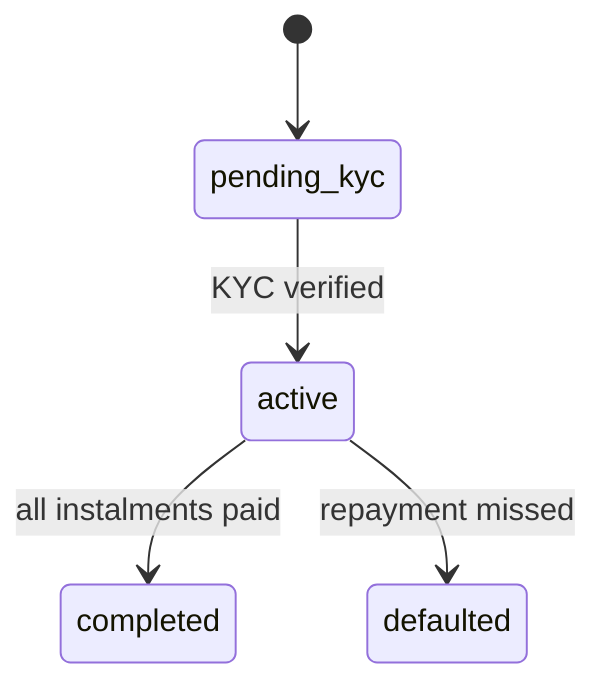

Buy-Now-Pay-Later looks simple from the outside: let a customer pay in a few
instalments instead of all at once. Under the hood, it is one of the most
unforgiving features you can build, because every edge case involves money.

Here is how I approached it when building the BNPL engine inside **Flayona**.

## Start with the ledger, not the UI

The temptation is to design the checkout screen first. Don't. The first thing I
modelled was the **money flow**: an order, the plan attached to it, and the
individual instalments that make up that plan.

```ts
type InstalmentPlan = {
  id: string;
  orderId: string;
  instalments: number;
  status: "pending_kyc" | "active" | "completed" | "defaulted";
};
```

Amounts are always stored as **integers in minor units** (pence, cents). The
moment you represent money as a float, you have signed up for rounding bugs you
will chase for weeks.

## Gate credit behind identity

You are extending credit, so you need to know who you are extending it to. In
Flayona, a plan cannot become `active` until the customer's **KYC** status is
verified. Encoding that as an explicit state — rather than a scattered boolean —
made the rule impossible to bypass.

## Model the lifecycle as a state machine

Instalment plans move through a small, explicit set of states. Every transition
is validated: you cannot complete a plan with an outstanding instalment, and you
cannot reactivate a defaulted one without a deliberate action.



## Make payment events idempotent

BNPL leans heavily on webhooks — a repayment succeeds, a card is declined. Those
events **will** be delivered more than once. Every handler keys off the
provider's event ID and a processed-events table, so a retry can never
double-apply a repayment.

## The lesson

In FinTech, the schema *is* the product. Get the data model, its invariants and
its idempotency right, and the interface almost writes itself. Get them wrong,
and no amount of UI polish will save you.
